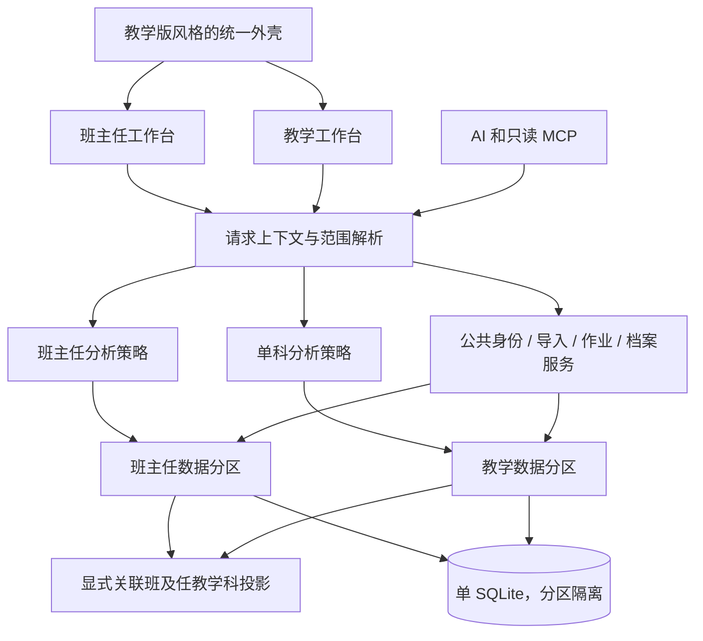

# 架构与数据契约（目标设计）

## 1. 单应用内部边界

**用户最新约束：只有本人担任班主任的班与对应教学班互通，其他教学班数据隔离。**

建议目录：`backend/app/core`（配置、db、认证、上下文）、`domains/{students,exams,homework,notes}`、`workspaces/{homeroom,teaching}`、`integrations/{chat,mcp}`。
前端：`app/homeroom/*`、`app/teaching/*`、`app/settings/*`、`app/upload`；共用 `components/layout`、`components/ui` 与 `features/*`。
不为搬目录做一次性大改；先保留 H 工程可运行，通过服务边界逐步移动。没有迁移完的目录在任务记录中注明。

## 2. 作用域契约

每个请求构建不可变 WorkspaceContext：`teacher_id, mode, data_domain, link_id/link_version, academic_year_id, term_id, grade, assignment_id/class_ids, subject, member_person_ids, as_of`。
客户端只提交 mode 和所选资源 ID；教师、可用身份、学科和允许成员从后端配置解析。不得信任客户端提交的成员列表或学科。

- 班主任：绑定行政班及有效时期；历史考试按考试发生时名册取范围。
- 教学：当前任教学科 + 所选教学班；“全部”只取同学年/年级下合法教学班成员并集。
- 空班、未配置、跨学科、跨年级请求明确返回空态或领域错误，绝不回退全年级。
- 年级排名背景数据与可浏览成员分开。可为范围内学生附原年级排名，但不能由此开放全年级学生明细。
- 学生个人跨年画像：先验证该人在目标工作台可访问，再按已确认 alias 读取允许的学科历史；不能借任一历史学号遍历无关人，也不能靠同号自动跨数据域关联。
- 考试详情/历史班对比以当时成员为准；当前名单看板按当前成员；画像展示历史跨度。响应明确 `membership_basis`。
- 身份合并、考试删除按所属域操作；影响关联班共享数据时提供双方影响预览。完整备份恢复属于全应用操作。

建议 API：`/api/v1/homeroom/*`、`/api/v1/teaching/*`、`/api/v1/shared/*`。
分析同名路径可共享 schema 外壳但不强迫相同结果结构。公共响应 metadata 至少含 `mode, subject, scope, metric, cohort_size, data_revision`。
排名指标须含分值类型、升降方向、人群和同分规则；无效参数 422，合法 ID 不在范围内拒绝，未配置返回可识别配置错误。P1 固定具体错误码及 OpenAPI 样例。
旧无 mode API 不允许猜测；需要兼容时建立显式域适配器，并在 P6/P7 验证所有调用方。

## 3. 数据模型

| 目标实体 | 职责/约束 | 旧数据来源 |
|---|---|---|
| TeacherProfile | 首版一位老师，启用的工作台、任教学科；身份绑定分表 | 两版 Teacher 合并冲突逐字段列出 |
| AcademicYear / Term / Cohort | 学年、学期、入学届别分离；日期和时区明确 | Exam/学期配置推断，未知留待核实 |
| StudentIdentity | 域内人的稳定内部 ID；只有关联班才建立跨域 person link，姓名为展示字段 | H/T StudentIdentity |
| StudentAlias | 学号及数据域、来源、学校、学年有效范围；唯一性不是裸学号全局唯一 | StudentAlias、旧带前缀 ID、名册、成绩 |
| AdministrativeClass / Enrollment | 行政班和人在其中的起止时间、状态、座号 | H ClassRoster、教师绑定、考试快照 |
| TeachingClass / Membership | 学年、学科、标签、成员有效期及来源 | T TeachingClass/Member；同名不同学年独立 |
| Exam / Upload / SubjectScore / TotalScore / ClassAverage | 按域保存考试事实；H 全科/总分、T 单科；关联班行级共享并保留来源和修订 | 两库同类表；新增来源映射 |
| ImportedHistory | 个人历史展示，不进入班级/年级统计 | H ImportedHistory |
| HomeworkAssignment / Submission | 布置收交批次、应交成员快照、逐人状态和评价 | 两版作业，详见下一节 |
| StudentNote / SpecialRecord | 人、发生日期、来源/适用范围、跟进 | 两库同类表 |
| AnalysisSetting / ViewPreference | 业务阈值与界面选择分离 | AnalysisConfig、HomeworkSetting |
| AuditEvent / MigrationRun / SourceMap | 操作审计、导入批次、来源到目标 ID 的完整映射 | ChangeLog、撤销快照、新迁移台账 |

具体列名在 P1 建模时落实；以下约束必须落数据库及测试，不能只靠 UI：
- 学号保留字符串和前导零；旧 `_anon:`、TMP、`g1-`、`G1::` 原值可追溯，不按正则直接剥掉后合并。
- 一个来源行 `(source_database_fingerprint, table, primary_key)` 只能有一个有效映射；不同来源仅在已确认关联班范围内可指向同一共享事实，其他来源始终分区。
- 成绩唯一键围绕 `data_domain + exam + person/alias + subject/total_type` 建立，同一考试修订走显式版本替换，不能重复插入放大人数。
- 成员唯一约束包含班级及有效期；历史 unknown 的起止日期不伪造精确值。
- Foreign key、唯一约束及数据库事务开启并验证；移除“导入 models 就自动生产迁移”的隐式副作用。
- 新迁移使用带版本的迁移流程（可用现有依赖 Alembic）；旧启动迁移仅在隔离源副本适配，不对合并库重复运行。

## 4. 作业的统一语义

核心字段分离：`subject=物理`、`homework_type=校本作业`、`assignment_id=具体一次作业`。
Assignment 保存日期、班级范围、批次来源、当时应交成员快照、修订号；Submission 唯一键 `assignment_id + person_id`。
状态至少区分已交、缺交、请假/免交、未知；评价另列，不能从“优秀”以外的缺失评价推断缺交。

- H：subject 映射学科，种类无来源时记“未分类”，缺交行保留；全交台账迁为收交事件。
- T：subject 映射作业种类，学科依据源教师配置及历史证据；不确定不猜；保留 submission_status/evaluation。
- “全交”展开当时应交名单。先解析全批次，再应用明确个人例外；行顺序不影响结果。相互矛盾的多个个人状态必须报冲突。
- 预览返回带内容摘要/作用域/版本的 token；确认时校验未过期且班级和版本未变，整批事务写入。
- 允许一天同科同种类多份作业；重试同 token 不新增数据。手工再次录入同一批次走编辑而非隐式叠加。
- 连续缺交按收交事件排序，已交/免交打断；未知不判缺交，不跨越未知事件宣称连续。日维度统计与事件维度预警要分别标明。
- 提交率分母为该批次应交快照（按规则扣除免交），不是今天班级人数。历史仅有缺交的批次没有可靠分母，显示“无法计算”，不推断其余全交。
- 班主任看各科及本行政班成员，教学看任教学科及教学成员。只有已关联班且在有效期/成员交集/学科范围内才引用同一作业事实；同日同学生同学科不证明是同一份作业，迁移不自动去重。
- 排除统计是工作台/成员关系上的设置，不是把这个人全局禁用；迁移两版 excluded 各自保留。
- 修订、删除或撤销后重算指标；撤销先检查批次后续依赖，有后续编辑则提供冲突，不能覆盖后来合法数据。

## 5. 界面与前端状态

直接沿用 T `Shell/Sidebar/Topbar`、Tailwind token、表格、菱形卡片标记、浅网格背景和打印规则。
布局仍由 Shell 统一负责；公共卡片只封装展示，业务计算不进入 UI。
不新增状态库作为合并前提，沿用 React Context 和现有请求方式，集中封装带范围的客户端。

URL 为工作台及资源上下文的权威来源；缓存键包含 mode、学年、学期、班、学科、考试、数据修订。
快速切换时取消旧请求并以请求世代号拦截迟到响应；聊天流同样处理。
切换前保留或提示未提交的录入草稿；两标签页分别浏览两个工作台不能相互切换全局后端配置。
移动端 390/768、桌面 1280/1440 验证；宽表有卡片或横向滚动，切换器支持键盘、焦点与选中态。

## 6. AI / MCP

SSE 与工具注册公共化，工具调用同一业务服务。聊天会话绑定不可变 scope 及关联版本快照；换工作台开启独立会话或明确分段，不把原范围工具结果带入新问题。
MCP 请求显式传工作台/合法范围，服务端再次解析并检查班级关联；保留只读清单，无法通过工具参数调用写操作。
允许同一单用户会话使用两个已配置工作台，但不得依赖模型自觉过滤。兼容旧客户端时可暴露两个固定范围入口，共用后端。
首版不扩张为多用户平台；现有公网/内网鉴权语义必须在部署测试中明确，不能当成已实现多用户隔离。

## 7. 班主任班与教学班的受控关联（最高优先级边界）

单库采用 `data_domain=homeroom|teaching`、来源班级和事件时间标记。每个业务查询必须经域 repository/context，不允许无范围 ORM 查询泄露跨域数据。
代码、布局、数学计算和备份设施复用；业务数据的“互通”只通过下面的关系发生。

`HomeroomTeachingLink`：行政班 ID、教学班 ID、学年、任教学科、有效起止、共享类别、状态、版本。
关联候选可以按班标签建议，但必须由本人在配置页确认；同班号、同名或同学号都不能自动建立关联。
首版每个行政班在同一时期/任教学科关联一个对应教学班；不支持多个无关教学班混合关联。
`LinkedStudent`：关联 ID + H person ID + T person ID + 确认依据；同号同名也须结合学年/班级和预览确认。

| 数据 | 关联班默认行为 | 其他教学班 |
|---|---|---|
| 名册 | 行政班名册为权威来源，同步投影到对应教学班；差异预览 | 完全独立 |
| 当前任教学科成绩 | H 或 T 有合法来源都可成为共享事实，双方见同一规范值 | 仅 T 可见 |
| 其他学科/总分 | 仅 H 可见 | 不进入 H |
| 当前任教学科作业 | 两侧允许录入/修订，引用同一 assignment/submission | 仅 T 可见 |
| 其他学科作业 | 仅 H 可见 | 不进入 H |
| 谈话、家访、奖惩、备注 | 默认不共享，教学观察条目也按来源隔离 | 完全独立 |
| 身份历史 | 仅双方明确关联的这个学生，按工作台允许学科投影 | 不跨域合并 |

“一次写入，按关联读取”是目标，不用数据库触发器把整张表复制到另一域。共享记录保留原始归属及双方引用。
对来自双方的同一考试单科冲突，列出值和来源，确认规范值后双方一致；禁止最后写入覆盖。
编辑共享事实带 `revision` 乐观锁，旧版本修改返回 409。修改名册优先在 H 完成，T 的关联名册提供跳转/变更申请，不独立删掉 H 学生。
考试级共享不能放开整场考试：H 的全科、其他行政班背景行始终不通过关联返回；T 的其他班同场考试行也不进入 H。
新增 T 学科成绩进入 H 只补该科，不虚构总分和年级排名。缺少完整总体数据时标明范围及不可计算项。

撤销关联即时停止跨域可见，清理相应缓存和聊天工具快照；原数据各归来源保存，域内原生记录保留，不删除历史。
关联生效前的历史共享需单独选择日期范围，不能默认开放学生全部历史。换届必须新建或更新关联有效期，不能按同班号沿用。
名册成员不完全相同则共享交集，差异单列；不能通过把其他教学班学生加入请求参数扩大关联。
备份是同一应用的完整备份，覆盖两个域和关联关系；这不意味着业务查询可跨域读取。
